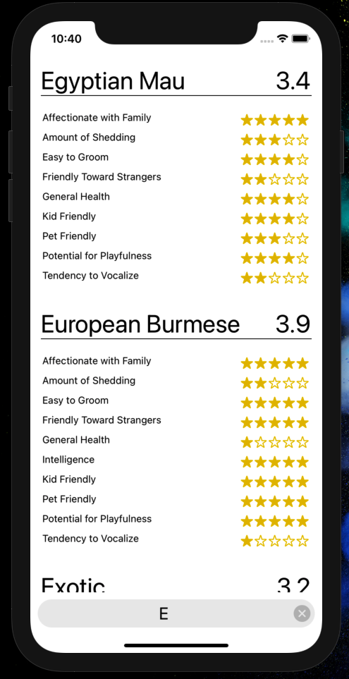

# Fursonalities

Mobile application with React Native that displays a list of pet breeds along with their features.  Introduction to working with mobile UI components like the ListView, FlatView, and more

    

# Resources
- [FEW 2.4 - Assignment 4](https://github.com/Make-School-Courses/FEW-2.4-Native-Development-with-JavaScript/blob/master/Assignments/Assignment-4-mobile-app.md)
